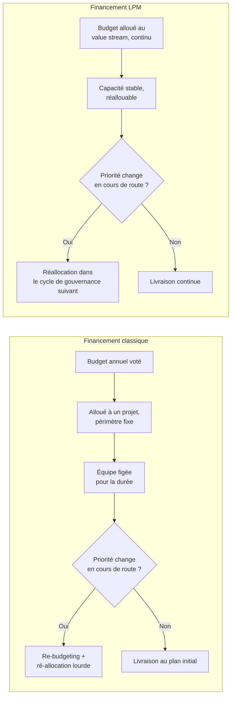
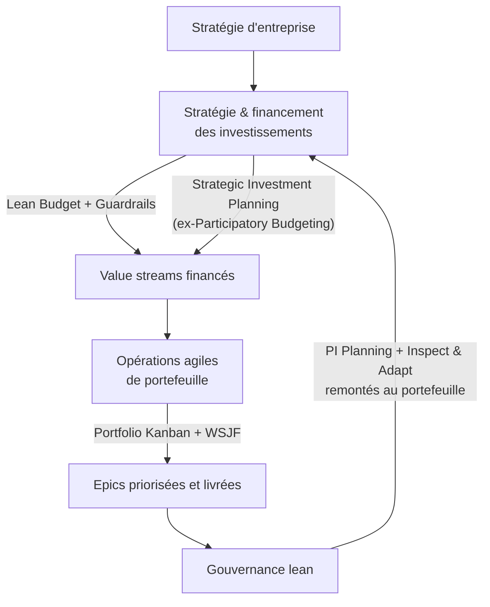
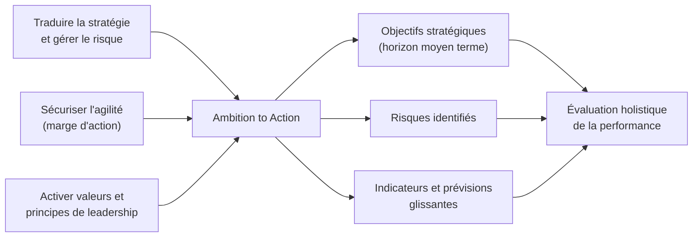
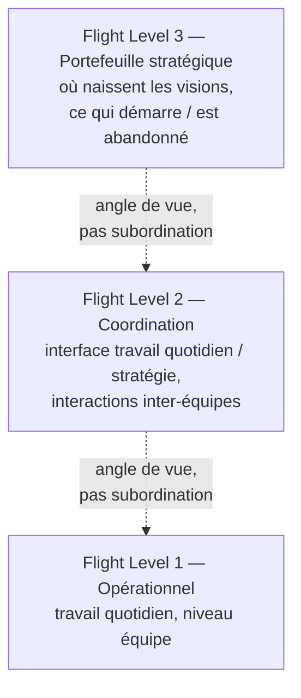
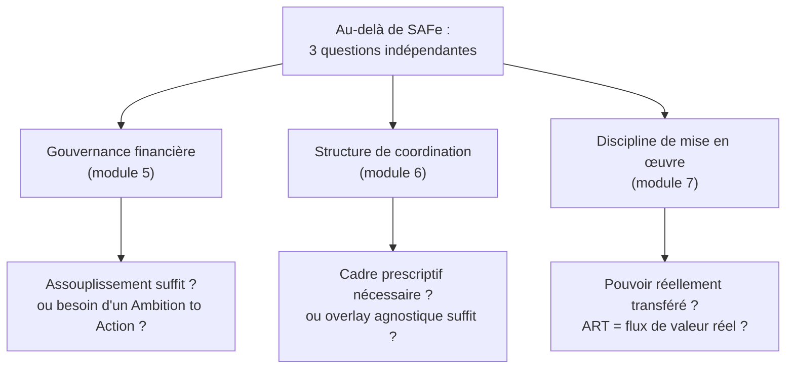

# Lean Portfolio Management, au-delà de SAFe

## Module 1 — D'où vient réellement le "Lean" du Lean Portfolio Management

SAFe présente le Lean Portfolio Management comme une évidence méthodologique : financer des value streams plutôt que des projets, prioriser avec WSJF, gouverner par guardrails. Ce triptyque a une origine précise, et ce n'est pas SAFe. Comprendre cette origine change ce qu'on fait avec le triptyque une fois qu'on quitte le cadre du framework.

### Le premier lean n'était pas fait pour le développement de produit

Le lean, au sens où Toyota l'a formalisé dans les années 1950-1980, est un système de production. Son objet est la fabrication répétitive : éliminer le gaspillage, standardiser les gestes, réduire la variabilité parce que la variabilité dans une chaîne de montage est un défaut. Le TPS (Toyota Production System) part d'un postulat implicite : la tâche est connue, répétée, et l'incertitude est l'ennemi.

Le développement de produit — et a fortiori la gestion de portefeuille d'initiatives — ne ressemble pas à ça. On ne sait pas à l'avance combien de temps prendra une fonctionnalité, ni si elle générera la valeur espérée, ni si les hypothèses de départ tiendront. Appliquer telles quelles les recettes de la chaîne de montage (réduire la variabilité, standardiser) à un contexte où l'incertitude est la matière première du travail est une erreur de catégorie.

C'est le diagnostic que pose Donald Reinertsen dans *The Principles of Product Development Flow* (2009), sous-titré *Second Generation Lean Product Development*. Le sous-titre est le message : il existe une première génération de lean, transférée directement de la production industrielle (réduire le gaspillage, faire bien du premier coup, standardiser), et elle est insuffisante pour le développement de produit parce qu'elle transpose mal la gestion de l'incertitude. Une deuxième génération doit être fondée sur l'économie, statistiquement robuste, tolérante à la variabilité, et optimisée pour le flux plutôt que pour l'efficience locale.

### Le déplacement conceptuel : de l'efficience locale à l'économie globale

Le cœur de l'apport de Reinertsen tient dans une phrase qu'il pose comme prémisse : on fait du développement de produit pour gagner de l'argent. Ce n'est pas une trivialité rhétorique — c'est un rejet explicite de la manière dont la plupart des organisations pilotent réellement leurs portefeuilles, à travers des variables proxy : le taux d'utilisation des équipes, le respect des délais, le pourcentage de temps à "valeur ajoutée". Ces variables sont mesurables et rassurantes, mais elles ne disent rien du profit réel généré. Reinertsen les qualifie de substituts qui masquent l'objectif économique réel : le profit sur le cycle de vie (*life-cycle profits*).

L'exemple le plus parlant est celui de l'utilisation des capacités. L'intuition managériale classique pousse à maximiser l'occupation des équipes — 100% d'utilisation, personne inactif. Reinertsen la qualifie de désastre économique : faire tourner un processus de développement de produit près de sa pleine utilisation génère des files d'attente longues, des retards de projet, et une variabilité élevée entre prévisions et réalisations. Une étude d'Adler citée dans ce corpus conclut que réduire le taux d'utilisation planifié à 80% aurait pu réduire les temps de développement de 30% ou plus — un résultat contre-intuitif pour quiconque a été formé à l'efficience industrielle classique.

Le livre organise ses 175 principes de flux en huit groupes, dont les plus structurants pour la suite du cours sont : améliorer les décisions économiques, gérer les files d'attente, réduire la taille des lots, appliquer des contraintes de travail en cours (WIP), accélérer le feedback, et décentraliser le contrôle. Ce sont ces six axes — pas les cérémonies, pas les rôles — qui constituent le socle théorique que tout dispositif de gestion de portefeuille lean, SAFe compris, prétend appliquer.

### Le concept qui traverse tout le reste du cours : le coût du délai

Le concept le plus opérationnel de ce corpus, et celui qui reviendra à chaque module suivant, est le **Cost of Delay** (coût du délai). L'idée : presque tous les facteurs économiques d'une décision de développement de produit se ramènent, in fine, à la gestion du délai. Retarder une fonctionnalité a un coût, même si ce coût est invisible dans la comptabilité classique — parce que les stocks de travail en cours (spécifications en revue, designs "presque finis", tickets "en cours") ne sont pas comptabilisés comme le seraient des stocks physiques dans une usine, alors qu'ils immobilisent de la valeur exactement de la même manière.

Reinertsen pose une règle qui deviendra, une fois simplifiée par SAFe, l'outil WSJF que tout praticien SAFe connaît : « nous n'avons simplement aucune raison de faire des arbitrages en temps de cycle si nous ne connaissons pas la valeur économique de ce temps de cycle ». Autrement dit, sans coût du délai quantifié, toute décision de priorisation est un pari sur du vent — de l'intuition, du rapport de force politique, ou une optimisation locale qui dégrade le système global.

### Ce que cette origine change pour la suite

Retenir ce module change la lecture de tout ce qui suit dans ce cours. Le Lean Portfolio Management n'est pas une invention de Scaled Agile — c'est une adaptation, à l'échelle du portefeuille, d'un corpus théorique antérieur et plus rigoureux sur la gestion économique du flux en contexte incertain. SAFe a popularisé une version opérationnalisée de ce corpus — WSJF, Portfolio Kanban, guardrails — mais l'a aussi simplifiée, parfois au point de perdre la substance qui rendait l'outil original puissant. Le module 3 y reviendra en détail sur WSJF spécifiquement.

Il existe aussi, en parallèle du courant Reinertsen, un second mouvement antérieur ou contemporain à SAFe qui attaque un autre pilier du portefeuille traditionnel — le budget annuel lui-même. C'est le sujet du module 5 : Beyond Budgeting. Les deux courants (Reinertsen sur le flux et l'économie de la décision, Beyond Budgeting sur la gouvernance financière) convergent vers une même conclusion : la gestion de portefeuille traditionnelle optimise les mauvaises variables, avec les mauvais horizons temporels, avec un excès de contrôle centralisé. SAFe LPM est une synthèse partielle de ces deux courants, pas leur origine.

---

## Module 2 — Le problème que LPM résout : le budget annuel comme goulot d'étranglement

### Une discipline née dans les années 1950, pour un autre monde

Le project portfolio management (PPM) classique a des racines dans les théories financières des années 1950, centrées sur la mitigation du risque et l'optimisation des ressources [monday.com, 2025]. La logique sous-jacente : un portefeuille de projets fonctionne comme un portefeuille d'actifs financiers — on diversifie, on alloue du capital selon un rendement attendu, on fixe un cadre annuel, on mesure l'écart au plan. C'est une logique d'allocation statique, pensée pour un environnement où les hypothèses de départ restent valides sur la durée du financement.

Le problème : un projet de développement logiciel ou de produit n'est pas un actif financier stable. Les hypothèses de valeur changent en cours de route, parfois en quelques semaines. Un cadre budgétaire annuel avec périmètre fixe est donc structurellement en décalage avec la vitesse à laquelle l'information nouvelle doit pouvoir influencer les décisions.

### Le mécanisme du blocage : budget et personnel figés pour la durée du projet

Le nœud du problème n'est pas philosophique, il est mécanique. Dans le modèle classique, une fois le projet lancé, le budget et les personnes affectées sont fixés pour toute sa durée. Quand les besoins métier évoluent — et ils évoluent presque toujours — l'organisation ne peut pas changer de plan sans la lourdeur d'un re-budgeting et d'une ré-allocation de personnel [Reinertsen, cité in Lean Budgets, 2022]. Ce n'est pas une friction mineure : c'est un verrou qui empêche la réallocation rapide de capacité vers ce qui a le plus de valeur *maintenant*, pas ce qui avait le plus de valeur au moment de l'approbation du budget, six ou douze mois plus tôt.

Le symptôme classique de ce blocage : la mesure de succès d'un projet, une fois celui-ci terminé, se réduit à « a-t-il fini dans les temps et dans le budget ? » — pas « a-t-il livré de la valeur au client ou au marché ? » [Planview, 2026]. Le système mesure sa propre conformité à un plan, pas le résultat économique réel. C'est une boucle de feedback qui pointe dans la mauvaise direction.

### Ce que le Lean Portfolio Management change structurellement

Le schéma ci-dessous oppose les deux logiques de financement — pas seulement en nature (projet vs value stream), mais dans la manière dont chacune répond au changement de priorité.

Le déplacement que propose LPM, dans sa version SAFe comme dans ses variantes non-SAFe, porte sur trois axes simultanés, et c'est leur combinaison qui produit l'effet, pas un seul isolément :

**Financement par flux de valeur plutôt que par projet.** Au lieu de financer des projets à périmètre fixe et durée limitée, on finance des value streams — des structures organisationnelles pérennes, orientées autour d'un flux de valeur continu vers le client. Le budget n'est plus attaché à un livrable défini à l'avance, mais à une capacité d'exécution qui reste stable dans le temps, réallouable en fonction des priorités qui évoluent [Planview, 2026].

**Décision décentralisée plutôt que planification centralisée à cycle long.** LPM privilégie une planification continue et adaptative, avec une prise de décision décentralisée, permettant aux organisations de pivoter rapidement sur la base d'un feedback en temps réel plutôt que d'attendre le prochain cycle budgétaire [monday.com, 2025]. Le contraste est net avec la gestion de portefeuille traditionnelle, qui repose typiquement sur une planification top-down à cycle long, à périmètre fixe et contrôle centralisé — un modèle moins réactif par construction [monday.com, 2025].

**Gouvernance par cas d'affaires léger plutôt que par plan de projet lourd.** Le business case classique — document exhaustif justifiant chaque dépense a priori — est remplacé par un cas d'affaires allégé, juste assez d'information pour prendre une décision go/no-go de financement et de priorité [Planview, 2026]. La décision se décentralise ensuite : ce sont les responsables des value streams qui déterminent comment atteindre les objectifs stratégiques de l'organisation, pas un comité central qui valide chaque étape.

### Ce que ce changement de modèle ne dit pas encore

Ce module a posé le problème et le déplacement conceptuel général que LPM propose. Il n'a pas encore répondu à deux questions pratiques que la suite du cours traite en détail : comment prioriser objectivement entre initiatives concurrentes quand le budget n'est plus alloué projet par projet (module 3, WSJF) et comment allouer concrètement le capital entre value streams sans reproduire, sous un autre nom, la lourdeur du cycle budgétaire annuel qu'on cherche à quitter (module 4, gouvernance lean et Strategic Investment Planning).

Il faut noter aussi, dès ce stade, que la critique du budget annuel n'est pas propre à l'agilité à l'échelle ni à SAFe. Elle est antérieure : le mouvement Beyond Budgeting, né dans les années 1990 chez des praticiens de la finance d'entreprise, portait une critique structurellement identique — indépendamment de tout contexte logiciel ou agile — bien avant que SAFe ne formalise le Lean Portfolio Management. Le module 5 y revient en détail, avec un cas industriel (Handelsbanken) qui a abandonné le budget en 1970, quarante ans avant que SAFe n'existe.

---

## Module 3 — WSJF : l'outil et sa version édulcorée

### La formule qu'on enseigne dans toute certification SAFe

WSJF (Weighted Shortest Job First) est l'outil de priorisation économique le plus visible du Lean Portfolio Management version SAFe. La formule : Coût du délai (Cost of Delay) divisé par la durée du job (ou sa taille relative). Le Cost of Delay lui-même se décompose en trois composantes, chacune notée sur une échelle de Fibonacci relative (1, 2, 3, 5, 8, 13, 20) : la valeur business/utilisateur, la criticité temporelle, et la réduction de risque / activation d'opportunité [Kaizenko, 2026]. On additionne les trois scores, on divise par la taille estimée du travail, et on obtient un score WSJF qui sert à ordonner le backlog.

C'est un outil séduisant sur le papier : il rend la priorisation objective, évite les négociations d'opinion, et force une discussion structurée sur la valeur relative des initiatives. Dean Leffingwell l'a adapté du travail original de Reinertsen pour l'intégrer à SAFe [Kaizenko, 2026].

### Ce que dit Reinertsen, et ce qu'en a fait SAFe

Le problème, documenté de manière convergente par plusieurs praticiens expérimentés du sujet, tient dans l'écart entre le WSJF de Reinertsen et le WSJF-SAFe. Dans la formulation originale de Reinertsen, WSJF = Cost of Delay / Duration, où le Cost of Delay est une estimation *économique réelle* — un montant, ou à défaut une estimation calibrée dérivée d'une analyse de la valeur économique en jeu. Dans la version SAFe, le "cost of delay" devient la somme de trois scores relatifs qualitatifs, estimés collectivement lors d'un jeu d'estimation rapide [Jason Yip, 2024 ; Kaizenko, 2026].

Jason Yip, praticien qui documente cette critique depuis 2012 (soit bien avant l'écriture de ce cours, ce qui indique que le problème n'est ni nouveau ni résolu), formule le désaccord central : le "cost of delay" au sens SAFe n'a plus rien à voir avec le concept de Reinertsen. Une consultante spécialisée sur le sujet résume la même tension de manière plus abrupte : « la définition SAFe du Cost of Delay est nulle. Je ne la recommanderais pas » [LinkedIn, 2019].

`[débattu]` La critique la plus développée vient de Black Swan Farming (l'organisation cofondée par Reinertsen lui-même) : sans un véritable Cost of Delay quantifié économiquement, la plupart des bénéfices de la méthode s'évaporent. On ne peut pas faire d'arbitrages réels avec des estimations de valeur relatives et non calibrées. Le coût des files d'attente reste invisible. Le coût des gros lots de travail reste invisible. Les hypothèses sur la localisation de la valeur restent cachées. On reste bloqué à négocier des estimations de dates et de coûts, à s'obséder sur des métriques comme la vélocité [Black Swan Farming]. La conclusion de cette critique n'est pas que WSJF-SAFe est inutile — c'est qu'il produit une version édulcorée d'un outil potentiellement bien plus puissant, au point que « ce n'est pas le Cost of Delay que je connais ».

À l'inverse, la même source reconnaît un mérite réel à l'adoption SAFe : elle expose une audience beaucoup plus large à l'importance des méthodes d'ordonnancement et de la gestion des files d'attente. Ce n'est pas un rejet complet — c'est un jugement nuancé sur un compromis entre simplicité d'adoption et rigueur économique.

### Un problème pratique indépendant du débat théorique : la taille des chiffres

Au-delà du débat sur la nature du Cost of Delay, un problème plus terre-à-terre existe dans l'application de la formule : la durée du job. Utiliser des heures-personnes produit des valeurs si grandes que les scores WSJF deviennent illisibles — on se retrouve avec des centaines dès la première semaine d'usage. La pratique recommandée est d'utiliser une taille relative estimée (personnes-mois relatifs) plutôt qu'une mesure absolue [airfocus, 2020]. Ce détail, en apparence mineur, illustre un phénomène plus général : les outils de LPM, une fois transposés d'un cadre théorique vers une pratique d'atelier avec des équipes, subissent des ajustements pragmatiques qui les éloignent progressivement de leur fondement économique initial.

### Ce que ça implique pour un praticien

Le WSJF reste un outil défendable en pratique — y compris dans sa version SAFe — à condition de ne pas lui prêter une rigueur qu'il n'a plus. Il structure une conversation, force une explicitation de critères, évite l'arbitraire pur. Ce qu'il ne fait pas, dans sa version édulcorée : donner une véritable mesure économique de l'urgence. Un praticien qui veut retrouver la puissance originale de l'outil peut recalibrer le Cost of Delay avec des ordres de grandeur monétaires réels plutôt que des scores Fibonacci relatifs — ce que SAFe permet en théorie mais que peu d'organisations font en pratique, faute de discipline analytique ou de données fiables sur la valeur.

Ce constat sur WSJF est un cas particulier d'un phénomène plus large qui traverse tout le reste de ce cours : SAFe simplifie des concepts issus d'un corpus théorique plus rigoureux (Reinertsen pour WSJF, Beyond Budgeting pour le financement) pour les rendre adoptables à grande échelle par des organisations qui n'ont ni le temps ni la maturité analytique pour appliquer la version complète. Le gain en adoptabilité a un coût en substance. Ce n'est ni entièrement une réussite ni entièrement un échec — c'est un arbitrage, et le connaître change ce qu'on en attend.

---

## Module 4 — Les trois dimensions SAFe LPM en pratique

Ce module documente ce que SAFe fait concrètement, avant que les modules suivants n'explorent ce qui existe en dehors. SAFe structure le Lean Portfolio Management autour de trois fonctions [Cprime ; Scaled Agile] : Stratégie et financement des investissements, Opérations agiles de portefeuille, et Gouvernance lean.

Le schéma ci-dessus montre la boucle complète : la gouvernance lean referme le cycle en remontant l'apprentissage vers la fonction stratégie et financement, plutôt que de s'arrêter à la livraison.

### Stratégie et financement des investissements

Cette fonction connecte la stratégie d'entreprise au financement effectif des value streams. Le mécanisme central est le **Lean Budget** : au lieu de financer des projets individuels, le budget est alloué directement aux value streams, encadré par des **guardrails** — politiques et pratiques de dépense, de gouvernance, propres à chaque portefeuille [Planview, 2022]. Les guardrails ont deux natures distinctes : deux sont quantitatifs (ils guident l'allocation des investissements dans le budget approuvé) et deux sont qualitatifs, liés au processus de gouvernance lui-même [Scaled Agile, extended guidance].

Le mécanisme d'allocation collaborative, historiquement appelé **Participatory Budgeting**, réunit business owners, parties prenantes et fiduciaires pour décider ensemble de la répartition du budget entre value streams — plutôt qu'une allocation descendante décidée par un comité restreint [Planview, 2022]. `[actualité]` En 2026, Scaled Agile a renommé cette pratique **Strategic Investment Planning**, dans le cadre d'une refonte plus large qui inclut aussi l'abandon des releases numérotées et l'introduction d'« AI-Native SAFe » en juin 2026 [Portfolio Hub, 2026]. Le mécanisme reste fonctionnellement identique — un forum où des groupes de participants se voient attribuer une portion du budget total et doivent arbitrer collectivement entre initiatives concurrentes [Leanwisdom, 2024] — mais le changement de nom signale une volonté de repositionner la pratique loin de sa connotation "budget" au profit d'un vocabulaire plus proche de la planification stratégique.

### Opérations agiles de portefeuille

Cette fonction gère le flux de travail à travers le portefeuille, matérialisé par le **Portfolio Kanban** — visualisation du pipeline des grandes initiatives (Epics), avec des limites de travail en cours (WIP) qui empêchent le portefeuille d'accepter plus de travail qu'il n'en peut absorber [Portfolio Hub, 2026]. C'est ici que WSJF (module précédent) s'applique concrètement : Scaled Agile recommande une approche de jeu d'estimation en équipe permettant un scoring WSJF rapide de 40 à 50 Epics en une demi-journée, avec Business Owners, architectes d'entreprise et Epic Owners participant à une estimation collaborative en taille relative [Agility at Scale, 2026].

`[débattu]` Une analyse détaillée du Portfolio Kanban note que ce dispositif échoue dans plus d'organisations qu'il n'en aide — non pas parce que le système est défectueux en soi, mais parce qu'il est traité comme un tableau de statut plutôt que comme un outil de gestion de flux actif [Agility at Scale, 2026]. C'est une nuance importante : l'échec documenté n'est pas de l'outil, mais de l'usage qu'on en fait — un motif qui reviendra au module 7 sur les causes d'échec des transformations LPM.

### Gouvernance lean

Cette troisième fonction synchronise la planification et le feedback à l'échelle du portefeuille — via des mécanismes comme le PI Planning et l'Inspect & Adapt à l'échelle programme, remontés au niveau portefeuille pour ajuster stratégie et financement en continu plutôt qu'une fois par an [SixSigma.us, 2025]. C'est la fonction qui referme la boucle : elle donne au portefeuille la cadence régulière (souvent trimestrielle, alignée sur les cycles de PI Planning) qui remplace le cycle budgétaire annuel sans pour autant abandonner toute discipline de pilotage — l'objectif étant de créer du rythme et de la prévisibilité tout en restant réactif [Agile36, 2025].

### Ce que ce triptyque produit — et ce qu'il présuppose

Les trois fonctions, prises ensemble, matérialisent concrètement le déplacement conceptuel du module 2 : financement par value stream, décision décentralisée dans des guardrails, cadence de gouvernance courte plutôt que cycle annuel. C'est une opérationnalisation cohérente et documentée, avec des outils et des rituels précis.

Ce que ce triptyque présuppose, en revanche, mérite d'être nommé avant d'aller plus loin : il présuppose l'existence de value streams stables et bien délimitées, une capacité de l'organisation financière à sortir de la comptabilité par projet, et une volonté managériale réelle de décentraliser la décision — pas seulement en façade. Ces trois présupposés sont précisément les points de friction les plus documentés dans les échecs de transformation LPM (module 7). Avant d'y arriver, les modules 5 et 6 montrent qu'il existe d'autres manières de répondre au même problème — sans passer par SAFe du tout.

---

## Module 5 — Au-delà de SAFe #1 : Beyond Budgeting

### Un mouvement antérieur, né dans la finance d'entreprise, pas dans l'agilité

Beyond Budgeting n'est pas né dans une communauté agile. Le mouvement trouve son origine dans la pratique de la finance d'entreprise, formalisé par Jeremy Hope et Robin Fraser au tournant des années 2000, puis porté institutionnellement par le Beyond Budgeting Round Table (BBRT). Il pose un diagnostic radical, plus tranchant que celui de LPM version SAFe : le budget annuel classique n'est pas seulement lent — c'est un mécanisme de gouvernance intrinsèquement dysfonctionnel qui doit être aboli, pas seulement assoupli.

Bjarte Bogsnes, actuel chairman du BBRT et ancien cadre chez Statoil/Equinor, résume le double changement que le modèle exige : il faut changer à la fois les processus (passer d'un modèle stable à un modèle dynamique) et le leadership (passer d'une posture "Théorie X" — contrôle, méfiance par défaut — à une posture "Théorie Y" — confiance, autonomie) [Bogsnes, Business agility in practice]. Ce doublement est important : Beyond Budgeting ne propose pas seulement un nouvel outil financier, il exige un changement de posture managériale sans lequel l'outil seul ne produit rien.

### Les douze principes, et un point de désaccord sur leur nature

Le BBRT défend que les douze principes Beyond Budgeting sont des composants nécessaires de son modèle de gestion adaptative de la performance — c'est-à-dire qu'ils forment un tout cohérent, pas une liste d'options à picorer [Hope & Fraser, 2001, cité in recherche académique 2017]. `[débattu]` D'autres praticiens et chercheurs, en revanche, se sont concentrés sur des combinaisons plus limitées de ces principes, avec un accent particulier sur les six principes liés au processus plutôt qu'aux six liés au leadership [recherche académique, Canterbury 2017]. Ce désaccord sur la nature systémique ou modulaire du modèle a une conséquence pratique directe : une organisation peut-elle adopter "un peu" de Beyond Budgeting, ou l'ensemble ne fonctionne-t-il que pris en bloc ? Le BBRT penche vers le "en bloc" ; la pratique documentée de terrain montre des adoptions partielles, ce qui suggère que la question reste ouverte.

### Ambition to Action : le mécanisme de substitution chez Equinor

Le cas Equinor (ex-Statoil), où Bogsnes a personnellement piloté la mise en œuvre, donne le mécanisme concret qui remplace le budget : **Ambition to Action**.

Le processus a trois objectifs déclarés, visibles à gauche du schéma : traduire la stratégie et gérer le risque, sécuriser l'agilité (donner de la marge d'action et de performance), et activer les valeurs et principes de leadership [Bogsnes, slides Statoil journey]. Concrètement, il s'articule autour d'objectifs stratégiques (où allons-nous, à quoi ressemble le succès, sur un horizon moyen terme), de risques identifiés, et d'indicateurs et de prévisions glissantes qui remplacent la prévision budgétaire figée.

Ce dispositif s'accompagne d'un changement dans l'évaluation de la performance : Equinor passe d'une mesure par indicateurs-clés de performance classiques à une **évaluation holistique de la performance**, qui met l'accent sur le comportement et la livraison réelle plutôt que sur l'atteinte mécanique d'un chiffre budgété fixé un an à l'avance [Bogsnes, slides].

### Le cas le plus radical : Handelsbanken, sans budget depuis 1970

Si Equinor illustre une transition pilotée, Handelsbanken illustre un cas plus ancien et plus radical : la banque suédoise a abandonné le budget formel en 1970, sous la direction de son PDG Jan Wallander, et fonctionne sans budget depuis plus de 50 ans [Corporate Rebels, 2024]. C'est le cas fondateur cité par tout le mouvement Beyond Budgeting.

Le mécanisme, que Wallander a appelé le « principe de l'église », repose sur une décentralisation radicale : chaque agence (environ 800 dans le monde) est un centre de profit autonome, responsable de ses clients, de son personnel et de sa rentabilité, avec des limites d'approbation de crédit significativement plus larges que celles de ses concurrents [Corporate Rebels, 2024 ; recherche Danish banks, 2014]. Deux raisons initiales ont motivé cette rupture : le processus budgétaire consommait des ressources considérables, et le budget agissait comme un « contrat » qui figeait les agences dans des connaissances potentiellement obsolètes, en supprimant l'espace pour de nouvelles idées [Wallander, 1999, cité in recherche 2014].

Le résultat documenté sur la durée : pendant 41 années consécutives — et le décompte continuait au moment où ce constat a été publié — la banque a atteint son objectif déclaré, une rentabilité supérieure à la moyenne de ses concurrents [Beyond Budgeting Institute, Case Report Handelsbanken]. C'est un résultat rare dans ce corpus : une performance financière mesurée sur plusieurs décennies, pas une étude de cas ponctuelle post-transformation.

`[émergent]` Une limite honnête à ce cas, relevée par une analyse critique : la nature "conservatrice" de la banque, résultant justement de cette discipline décentralisée orientée coûts, pourrait aller à l'encontre d'un état d'esprit entrepreneurial en matière de nouveaux produits ou services [analyse critique, Substack 2024]. Le modèle excelle à la stabilité et à l'efficience de coût ; ce qu'il produit en matière d'innovation de rupture reste moins documenté.

### Ce que Beyond Budgeting apporte que SAFe LPM n'a pas

La comparaison directe avec le module 4 est instructive. SAFe LPM assouplit le cycle budgétaire (allocation trimestrielle plutôt qu'annuelle, guardrails plutôt que gates) mais garde une structure de gouvernance financière relativement classique — un budget total, alloué, encadré. Beyond Budgeting va plus loin : il ne s'agit pas d'assouplir le budget, mais de le remplacer par un dispositif entièrement différent (Ambition to Action, prévisions glissantes, cibles relatives plutôt qu'absolues). C'est une différence de degré qui devient une différence de nature — et c'est précisément le type d'écart que recouvre l'expression « au-delà de SAFe » : SAFe emprunte au vocabulaire du lean-agile financier sans nécessairement aller jusqu'au bout de la logique que Beyond Budgeting, antérieur de plus d'une décennie, avait déjà poussée à son terme.

---

## Module 6 — Au-delà de SAFe #2 : Flight Levels

### Un modèle qui refuse d'être un framework

Klaus Leopold, coach Lean-Kanban et consultant en management, a formulé le concept de Flight Levels dans son livre *Kanban in Practice*. La différence de posture avec SAFe est déclarée dès le départ : Flight Levels n'est pas un framework — il ne prescrit ni rôles, ni cérémonies, ni pratiques spécifiques. C'est un **overlay agnostique** qui fonctionne par-dessus les pratiques que les équipes utilisent déjà [Agility at Scale, 2026].

Le modèle distingue trois niveaux, non hiérarchiques — un point que Leopold insiste à répéter : ce ne sont pas des couches où l'une serait plus importante que l'autre, mais des angles de vue différents sur un même système, révélant chacun des dysfonctionnements différents [Justyna Pindel, LinkedIn 2021].

Les flèches en pointillé du schéma marquent volontairement l'absence de hiérarchie stricte entre les niveaux — chaque niveau peut révéler un dysfonctionnement indépendamment des autres.

### La comparaison directe avec SAFe qui revient sans cesse

La question la plus fréquemment posée à Leopold dans les retours documentés est directe : quelle différence avec les trois couches SAFe (Team, Program, Portfolio) ? Une réponse pragmatique qui circule dans la communauté : Flight Level 3 est effectivement une forme de gestion de portefeuille, mais avec davantage de composante stratégique explicite — une dimension que la « gestion de portefeuille » classique ne porte pas nécessairement [ProjectManagement.com, 2019]. `[débattu]` Cette réponse ne tranche pas complètement le débat : elle reconnaît une proximité structurelle réelle (trois niveaux, du local au stratégique) tout en défendant une différence de nature sur le contenu de ce qui se passe au niveau supérieur.

Le point différenciant le plus solide, documenté par plusieurs analyses indépendantes du modèle, n'est donc pas la structure en trois niveaux elle-même (SAFe en a aussi trois), mais l'absence de prescription en dessous : Flight Levels donne un modèle de pensée pour identifier où la coordination se dégrade et où une intervention au niveau portefeuille crée le plus de valeur, sans imposer les moyens d'y parvenir [Agility at Scale, 2026].

### Un cas d'usage réel : diagnostiquer une organisation, pas la reconfigurer d'un coup

Un exemple documenté par Leopold lui-même illustre l'usage diagnostique du modèle : dans une organisation, il identifie trois problèmes distincts en observant les trois niveaux : pas d'interactions réelles au niveau coordination, une stratégie de bonne qualité mais mal gérée au niveau stratégique, et pas de gestion end-to-end du flux de valeur [Leopold, Agile100 talk, 2024]. Le symptôme le plus révélateur qu'il relève : des équipes qui, après coup, tentaient de justifier leur travail en le rattachant a posteriori à un axe stratégique — « je travaillais sur ceci, ça rentre dans ce seau stratégique » — au lieu que la stratégie détermine en amont ce sur quoi on travaille. La stratégie n'est pas une méthode de justification, c'est censé être un mécanisme de sélection en amont [Leopold, Agile100].

### Ce que la légèreté du modèle coûte en pratique

`[débattu]` Un retour critique et détaillé d'un praticien ayant testé le modèle en 2024 pointe une limite pratique : le chapitre consacré à un « deep dive » sur les Flight Levels eux-mêmes déçoit, la majorité du contenu portant sur la préparation en amont de leur mise en place plutôt que sur le détail opérationnel du modèle une fois en place [Pacemkr, revue 2024]. Ce même praticien note un mérite réel : le vocabulaire utilisé (« visualiser votre situation » plutôt que « visualiser votre flux de travail ») est délibérément dépouillé de jargon Kanban, ce qui le rend compréhensible par du management intermédiaire et supérieur sans tomber dans le piège du « nerd agile » incompris — un atout réel pour la communication avec des dirigeants qui n'ont pas de vocabulaire agile.

Cette légèreté volontaire a un revers documenté : elle laisse davantage de travail de conception à l'organisation qui adopte le modèle, puisque rien n'est prescrit. Une organisation qui a besoin d'un cadre détaillé, avec des rituels et des rôles déjà définis — précisément ce que SAFe offre — trouvera Flight Levels sous-spécifié. Une organisation qui a au contraire une allergie documentée à la bureaucratie de framework, ou qui a déjà des pratiques établies au niveau équipe et cherche seulement à réparer la coordination inter-équipes et la vision stratégique, y trouvera un allègement bienvenu.

### Positionnement par rapport aux deux modules précédents

Flight Levels et Beyond Budgeting attaquent deux problèmes différents et largement indépendants. Beyond Budgeting s'attaque à la gouvernance financière — comment on finance et on évalue la performance sans budget rigide. Flight Levels s'attaque à la structure de coordination et de visibilité du flux de travail, sans se prononcer sur le financement. Les deux peuvent en théorie coexister avec ou sans SAFe : rien n'empêche une organisation d'utiliser un modèle Flight Levels pour visualiser son flux stratégique tout en conservant une gouvernance budgétaire classique, ou inversement d'adopter les principes Beyond Budgeting sur le financement tout en gardant une structure de coordination SAFe. C'est un point qui prépare directement le module 8, sur les logiques d'hybridation.

---

## Module 7 — Pourquoi les transformations LPM échouent

### Le chiffre qui structure ce module, et sa vraie signification

Plus de 70% des transformations échouent, et ce taux d'échec se retrace le plus souvent à une résistance liée à la gouvernance et au modèle de financement — pas aux pratiques agiles elles-mêmes [Agility at Scale, 2026]. Ce chiffre mérite d'être lu avec précision : il ne dit pas que les cérémonies SAFe (PI Planning, rituels d'équipe) échouent. Il dit que le point de rupture se situe systématiquement au niveau où LPM touche à quelque chose de plus profond que la méthode — qui décide, comment l'argent circule, ce qu'on mesure. LPM n'est pas seulement un changement de processus : il altère fondamentalement qui prend les décisions, comment l'argent circule, et ce qui est mesuré [Agility at Scale, 2026]. C'est précisément la thèse du module 5 sur Beyond Budgeting, retrouvée cette fois du côté de l'échec plutôt que du succès.

### Le paradoxe de la décentralisation de façade

Le neuvième principe SAFe, Décentraliser la Prise de Décision, existe parce que la vitesse et la qualité s'améliorent quand les décisions sont prises par les personnes les plus proches du travail. `[débattu]` Pourtant les organisations adoptent fréquemment SAFe tout en conservant des chaînes d'approbation centralisées inchangées. Le résultat est un paradoxe documenté : les équipes passent par le PI Planning, s'engagent sur des objectifs, puis attendent des semaines des décisions qui devraient prendre quelques minutes [Agility at Scale, analyse "Why SAFe Principles Fail", 2026]. Le diagnostic de cette même analyse est cinglant sur la cause : le principe de décentralisation échoue non pas parce que les équipes ne sont pas prêtes pour l'autonomie, mais parce que la résistance organisationnelle du management intermédiaire rend l'empowerment réel structurellement impossible.

Ce diagnostic recoupe directement une observation du module 4 sur le Portfolio Kanban : l'outil échoue le plus souvent parce qu'il est traité comme un tableau de statut plutôt qu'un outil de gestion de flux actif [Agility at Scale, 2026]. Les deux constats convergent vers le même mécanisme d'échec — pas un défaut de conception de l'outil ou du principe, mais un traitement de conformité qui vide l'outil de sa fonction réelle. Traiter les cérémonies SAFe comme des exercices de conformité est un schéma d'échec remarquablement fréquent [Agility at Scale, 2026].

### Un deuxième mécanisme d'échec, plus structurel : la mauvaise unité d'organisation

Un mécanisme d'échec distinct, moins culturel et plus structurel, concerne la conception même des Agile Release Trains : les entreprises échouent fréquemment ici parce qu'elles conçoivent les ARTs autour des lignes hiérarchiques de reporting existantes plutôt qu'autour de la manière dont la valeur circule réellement pour le client [SkillifySolutions, 2026]. C'est un rappel utile que le module 2 avait déjà posé en filigrane : le passage au financement par value stream ne fonctionne que si le value stream correspond à un flux de valeur réel — pas à un redécoupage cosmétique d'un organigramme existant sous un nouveau vocabulaire.

Une même source note la distinction entre les parties visibles d'une transformation SAFe (ARTs, PI Planning, rôles, certifications) et ses parties invisibles, plus difficiles à établir : l'état d'esprit du leadership, l'ownership réel, la gestion des dépendances, la préparation du backlog, la conception du value stream, le changement de comportement [SkillifySolutions, 2026]. La plupart des transformations SAFe échouent non pas parce que le framework est mauvais, mais parce que le déploiement est précipité, que le leadership est mal aligné, ou que les équipes sont formées sans que le système autour d'elles ne change [SkillifySolutions, 2026]. C'est une nuance importante à retenir avant le module 8 : la critique documentée de SAFe porte rarement sur le contenu théorique du framework lui-même, mais sur la manière dont il est déployé — un déploiement rapide, formation-first, sans transformation du système de pouvoir et de financement qui l'entoure.

### Ce que les critiques les plus dures reprochent, spécifiquement

`[débattu]` Une critique plus frontale, publiée sous forme d'analyse comparative, va plus loin dans la généralisation : SAFe, initialement conçu pour aider les grandes entreprises à adopter l'agilité, est désormais critiqué pour ajouter de la bureaucratie, étouffer l'innovation, et privilégier le profit sur l'agilité réelle [DEV Community, analyse "Why SAFe Fails"]. Cette formulation est plus polémique que les analyses précédentes de ce module — elle mérite d'être signalée comme une position parmi d'autres, pas comme un consensus établi. Le poids relatif des positions dans ce corpus penche vers un diagnostic plus nuancé : SAFe fonctionne dans des cas documentés (Amdocs, réduction du temps de mise en production de 1,5 an à 8 mois ; Cerno, réduction de 58% du temps de cycle de livraison [Agility at Scale, citant Scaled Agile]), et échoue dans d'autres, avec un facteur causal récurrent identifiable — l'écart entre transformation de façade et transformation réelle des structures de pouvoir et de financement — plutôt qu'un défaut intrinsèque et universel du framework.

### Ce qu'il faut retenir pour la décision du module suivant

Les deux mécanismes d'échec documentés dans ce module — décentralisation de façade, ART calqué sur l'organigramme plutôt que sur le flux de valeur — ne sont pas spécifiques à SAFe. Ce sont des risques d'implémentation qui menaceraient tout aussi bien une adoption Beyond Budgeting mal préparée ou un déploiement Flight Levels superficiel. C'est le point de bascule qui prépare le dernier module : la question n'est peut-être pas tant « quel framework choisir » que « quelle discipline de mise en œuvre l'organisation est-elle réellement prête à tenir », quel que soit le modèle retenu.

---

## Module 8 — Choisir : SAFe, Beyond Budgeting, Flight Levels, ou hybride

### LPM n'appartient pas à SAFe

Un rappel factuel avant tout arbitrage : le Lean Portfolio Management n'est pas exclusif à SAFe. ICAgile et le Disciplined Agile de PMI publient chacun leur propre guidance de portefeuille lean, et de nombreuses organisations font tourner le modèle de financement sans adopter aucun framework dans son intégralité [Portfolio Hub, 2026]. SAFe dispose de la documentation la plus détaillée et de la certification la plus connue — mais ce n'est ni le seul chemin, ni nécessairement le plus adapté à toute organisation [Portfolio Hub, 2026].

### Trois axes de décision, pas un seul

Les modules 5 à 7 ont montré que « au-delà de SAFe » recouvre en réalité trois questions largement indépendantes.

**Sur la gouvernance financière** (module 5) : le cycle budgétaire de l'organisation peut-il tolérer un simple assouplissement (guardrails trimestriels, Strategic Investment Planning à la SAFe) ou le problème est-il plus profond — culture du contrôle, méfiance de la finance envers la décentralisation, besoin réel d'un modèle du type Ambition to Action ? Le cas Handelsbanken montre qu'un abandon complet du budget est possible et tenable sur des décennies — mais dans un secteur (bancaire, marché domestique stable) et avec une durée d'adoption (plus de 50 ans, sous un leadership continu) qui ne se transposent pas nécessairement à une organisation qui découvre le sujet aujourd'hui.

**Sur la structure de coordination** (module 6) : l'organisation a-t-elle besoin d'un cadre prescriptif avec rôles et cérémonies définis (ce que SAFe offre), ou dispose-t-elle déjà de pratiques d'équipe fonctionnelles et cherche-t-elle seulement à réparer la coordination inter-équipes et la lisibilité stratégique (ce pour quoi Flight Levels est taillé) ?

**Sur la discipline de mise en œuvre** (module 7) : quel que soit le modèle choisi, l'organisation est-elle prête à changer réellement les structures de pouvoir — pas seulement le vocabulaire — et à faire correspondre les unités organisationnelles au flux de valeur réel plutôt qu'à l'organigramme existant ?

### Ce que ces trois axes veulent dire pour un praticien SAFe qui veut aller plus loin

Pour quelqu'un qui pratique déjà SAFe et cherche à en dépasser les limites documentées dans ce cours, deux voies distinctes se dessinent, qui ne s'excluent pas :

La première consiste à **retrouver la substance derrière l'outil édulcoré**, sans changer de framework — recalibrer le Cost of Delay du WSJF avec de véritables ordres de grandeur économiques plutôt que des scores Fibonacci relatifs (module 3), ou pousser la logique des guardrails vers un modèle de prévisions glissantes et d'objectifs relatifs inspiré de Beyond Budgeting, sans nécessairement abandonner le vocabulaire SAFe pour autant.

La seconde consiste à **superposer un outil non-SAFe sur une structure SAFe existante** — utiliser une lecture Flight Levels pour diagnostiquer où la coordination portefeuille se dégrade réellement, indépendamment du fait que l'organisation continue par ailleurs d'appeler ça un ART ou une Solution Train. Le module 6 a montré que rien n'empêche cette coexistence, puisque Flight Levels ne prescrit rien qui entre frontalement en conflit avec une structure SAFe déjà en place.

### La question la moins confortable, et la plus honnête à se poser

`[débattu]` Ce cours n'a pas trouvé, dans le corpus rassemblé, de comparaison chiffrée et indépendante fiable du taux de succès de SAFe versus Beyond Budgeting versus Flight Levels sur des organisations comparables. Les chiffres de succès cités dans ce cours (Amdocs, Cerno) proviennent de la documentation officielle Scaled Agile — une source qui a un intérêt direct à démontrer l'efficacité du framework qu'elle commercialise. Symétriquement, les cas Handelsbanken et Equinor sont documentés par des sources proches du mouvement Beyond Budgeting lui-même. Cette absence de tiers véritablement indépendant est une limite réelle de ce corpus, qu'il faut nommer plutôt que masquer : aucun des trois modèles présentés dans ce cours ne dispose d'une preuve d'efficacité comparative qui ne soit pas, d'une manière ou d'une autre, produite par une partie prenante du modèle.

Ce que le corpus permet, en revanche, c'est d'identifier un facteur causal d'échec qui revient, lui, de manière indépendante et convergente à travers des sources différentes (module 7) : le problème n'est presque jamais le modèle choisi en soi, mais l'écart entre transformation affichée et transformation réelle des structures de pouvoir et de financement. C'est la conclusion la plus solidement étayée de ce cours, et probablement la plus utile en pratique : le choix entre SAFe, Beyond Budgeting et Flight Levels compte moins que la question de savoir si l'organisation est prête à changer réellement qui décide et comment l'argent circule — quel que soit le nom qu'on donne au dispositif qui l'organise.

---

## Glossaire

**Cost of Delay (Coût du délai)** — Estimation de la valeur économique perdue en ne livrant pas une initiative maintenant. Chez Reinertsen, une mesure économique réelle ; chez SAFe, une somme de trois scores relatifs qualitatifs (module 3).

**WSJF (Weighted Shortest Job First)** — Formule de priorisation : Cost of Delay divisé par la durée ou taille du travail. Sert à ordonner un backlog par urgence économique relative.

**Value stream (Flux de valeur)** — Structure organisationnelle pérenne organisée autour d'un flux continu de livraison de valeur au client, qui remplace le projet comme unité de financement dans LPM.

**Lean Budget Guardrails** — Politiques et pratiques encadrant la dépense et la gouvernance d'un portefeuille SAFe : deux guardrails quantitatifs (allocation d'investissement), deux qualitatifs (processus de gouvernance).

**Strategic Investment Planning (ex-Participatory Budgeting)** — Processus collaboratif SAFe d'allocation du budget de portefeuille entre value streams, renommé en 2026.

**Portfolio Kanban** — Tableau visualisant le pipeline des grandes initiatives (Epics) d'un portefeuille, avec limites de travail en cours (WIP).

**Beyond Budgeting** — Mouvement de gestion adaptative de la performance, né dans la finance d'entreprise, prônant l'abandon du budget annuel classique au profit de cibles relatives, de prévisions glissantes et d'une décentralisation radicale.

**Ambition to Action** — Mécanisme de gouvernance Beyond Budgeting utilisé chez Equinor, remplaçant le budget par des objectifs stratégiques, des risques identifiés, et des indicateurs/prévisions glissantes.

**Flight Levels** — Modèle de pensée en trois niveaux (opérationnel, coordination, stratégique) développé par Klaus Leopold, agnostique de tout framework, sans rôles ni cérémonies prescrits.

**Second generation lean** — Terme de Reinertsen désignant une approche du lean fondée sur l'économie de la décision et la gestion du flux dans l'incertitude, par opposition à la première génération transférée directement de la production industrielle.

---

## Vérification de compréhension

**1. Pourquoi Reinertsen qualifie-t-il son approche de "second generation lean" ? Qu'est-ce que la première génération transposait mal ?**
> La première génération transférait directement les recettes de la production industrielle (réduire le gaspillage, standardiser, éliminer la variabilité) à un contexte — le développement de produit — où l'incertitude est structurelle et non un défaut à éliminer. La deuxième génération fonde le pilotage sur l'économie de la décision plutôt que sur l'efficience locale.

**2. En quoi le WSJF-SAFe diffère-t-il du WSJF de Reinertsen, et pourquoi cette différence n'est-elle pas anecdotique ?**
> Chez Reinertsen, le Cost of Delay est une estimation économique réelle. Chez SAFe, c'est la somme de trois scores Fibonacci relatifs et qualitatifs. Sans calibration économique réelle, on ne peut plus faire d'arbitrages fiables sur le coût des files d'attente ou des gros lots — l'outil garde sa forme mais perd sa fonction de mesure économique.

**3. Quel est le mécanisme précis par lequel un budget annuel classique bloque la réallocation rapide de capacité ?**
> Une fois le projet lancé, budget et personnel sont fixés pour toute sa durée ; changer de cap en cours de route exige un re-budgeting et une ré-allocation de personnel — un coût de friction qui décourage l'ajustement même quand les besoins métier ont clairement changé.

**4. Qu'est-ce que le cas Handelsbanken apporte que les cas SAFe (Amdocs, Cerno) n'apportent pas ?**
> Une performance mesurée sur plus de 50 ans (41 années consécutives de rentabilité supérieure à la moyenne du secteur), plutôt qu'un résultat ponctuel post-transformation sur quelques mois — mais dans un secteur et un contexte spécifiques qui limitent la généralisation.

**5. Pourquoi dit-on que Flight Levels n'est "pas un framework" ? Qu'est-ce que ça change concrètement pour une organisation qui l'adopte ?**
> Il ne prescrit ni rôles ni cérémonies ni pratiques — c'est un modèle de pensée diagnostique, pas un ensemble de rituels à installer. Concrètement, l'organisation garde ses pratiques existantes et utilise le modèle pour repérer où la coordination casse ; en contrepartie, elle doit concevoir elle-même les solutions, sans gabarit prêt à l'emploi.

**6. Le module 4 note que le Portfolio Kanban "échoue plus d'organisations qu'il n'en aide". Ce diagnostic incrimine-t-il l'outil ou son usage ?**
> Son usage : l'échec vient du traitement de l'outil comme un tableau de statut passif plutôt que comme un instrument actif de gestion de flux — un motif qui recoupe la critique plus large du module 7 sur les cérémonies SAFe traitées en exercices de conformité.

**7. Pourquoi le module 7 affirme-t-il que la cause dominante d'échec des transformations LPM n'est "pas les pratiques agiles elles-mêmes" ?**
> Parce que le taux d'échec élevé (>70%) se retrace le plus souvent à une résistance sur la gouvernance et le modèle de financement — qui décide, comment l'argent circule — plutôt qu'à un rejet des rituels ou cérémonies agiles en tant que tels.

**8. Quelle est la limite méthodologique la plus honnête que ce cours reconnaît sur la comparaison SAFe / Beyond Budgeting / Flight Levels ?**
> Aucune comparaison chiffrée indépendante n'a été trouvée : les preuves de succès de chaque modèle proviennent de sources proches de ce modèle (Scaled Agile pour SAFe, mouvement Beyond Budgeting pour Handelsbanken/Equinor). Le corpus permet d'identifier des causes d'échec convergentes, pas un classement de performance entre modèles.

**9. En quoi le paradoxe de la "décentralisation de façade" (module 7) recoupe-t-il directement la thèse du module 5 sur Beyond Budgeting ?**
> Les deux pointent vers la même idée : le changement réel ne porte pas sur les processus visibles (cérémonies, budget trimestriel) mais sur le pouvoir de décision et le contrôle financier. Beyond Budgeting l'affirme comme prémisse ; le module 7 le retrouve empiriquement comme cause d'échec quand ce changement de pouvoir n'a pas eu lieu.

**10. Un praticien SAFe qui veut "aller au-delà de SAFe" a deux voies distinctes identifiées au module 8. Lesquelles, et en quoi sont-elles différentes ?**
> Retrouver la substance derrière l'outil édulcoré sans changer de framework (recalibrer WSJF avec de vrais ordres de grandeur économiques, par exemple), ou superposer un outil non-SAFe (comme une lecture Flight Levels) sur une structure SAFe existante sans l'abandonner. La première change le contenu de l'outil ; la seconde ajoute un outil de diagnostic externe sans toucher à la structure en place.

---

## Pour aller plus loin

### Tier A — Fondations théoriques

- **Reinertsen, Donald G. — *The Principles of Product Development Flow: Second Generation Lean Product Development* (2009).** Le texte fondateur de tout ce cours. 175 principes organisés en 8 groupes ; base théorique de WSJF, du Cost of Delay, et de la critique de l'utilisation maximale des ressources. À lire pour comprendre ce que SAFe a simplifié.
- **Hope, Jeremy & Fraser, Robin (2001) — travaux fondateurs du Beyond Budgeting Round Table.** Origine académique des douze principes Beyond Budgeting, cités dans toute la littérature ultérieure sur le sujet.
- **Bogsnes, Bjarte — *This Is Beyond Budgeting: A Guide to More Adaptive and Human Organizations* (2023).** Par le chairman actuel du BBRT, praticien ayant piloté la mise en œuvre chez Equinor. Combine principes de leadership et processus de management, avec études de cas réelles.

### Tier B — Rapports institutionnels et documentation de référence

- **Scaled Agile — Framework SAFe, sections Lean Portfolio Management, WSJF, Lean Budget Guardrails, Strategic Investment Planning.** Documentation officielle, à lire en connaissant les limites discutées aux modules 3 et 4.
- **Beyond Budgeting Institute — Case Report Handelsbanken: Consistency at Its Best.** Rapport détaillé sur le mécanisme de décentralisation et les résultats de long terme de la banque.

### Tier C — Terrain, retours d'expérience, débats de praticiens

- **Jason Yip — "Problems I have with SAFe-style WSJF" (Medium, 2024, republication d'un article initial de 2012).** La critique la plus longue et la mieux argumentée de l'écart entre WSJF-Reinertsen et WSJF-SAFe.
- **Black Swan Farming — "SAFe and Weighted Shortest Job First (WSJF)".** Critique par l'organisation cofondée par Reinertsen lui-même ; nuance importante entre rejet et reconnaissance des mérites d'adoption.
- **Klaus Leopold — *Flight Levels* et *Kanban in Practice*.** Source primaire sur le modèle Flight Levels, complétée par les retours d'expérience publiés (Agile100, LEANability Blog).
- **Agility at Scale — série d'articles sur LPM, WSJF, Portfolio Kanban, échecs de transformation SAFe.** Corpus le plus récent et le plus détaillé rassemblé pour ce cours sur les mécanismes concrets d'échec et de réussite.
